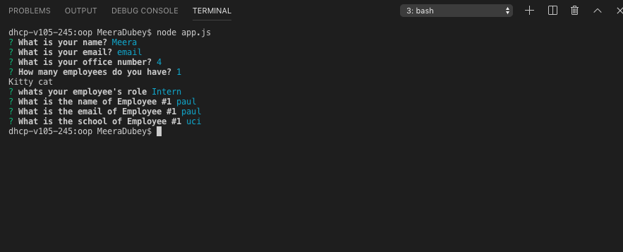

# oop
This template engine provides a user summary. The command line application will prompt the user for information about the team manager and then information about the team members. The app will run as a Node CLI to gather information about each employee. The user must use the Inquirer npm package to prompt the user for their email, id, and specific information based on their role with the company.
